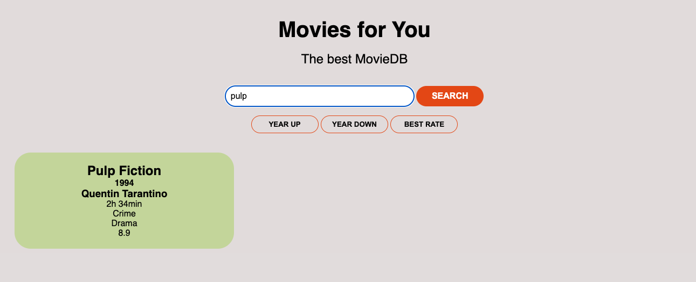

# Movie Database

- Within the film database you can search for films by title, year of release, duration, director, genre and rating.
- You can also sort the database. Either ascending or descending by year of release or by the best rating.
- With this project I have learned to combine and use different loop and string methods.
- I mainly worked with the array methods filter(), forEach(), and sort()

## Demo

https://cecilestaller.github.io/js-project-movieDB_complete/

## Screenshots

## Tech Stack

- HTML5
- CSS
- JavaScript

## Authors

- [@cecilestaller](https://github.com/cecilestaller)
